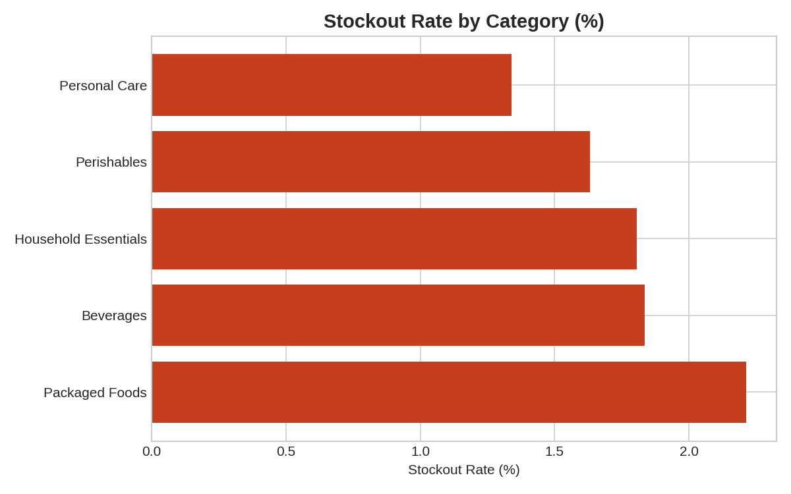
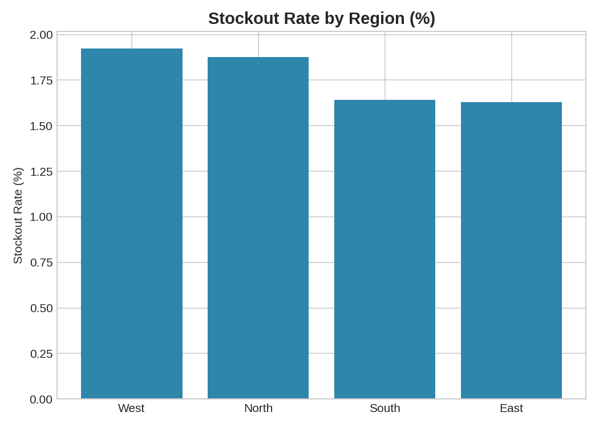
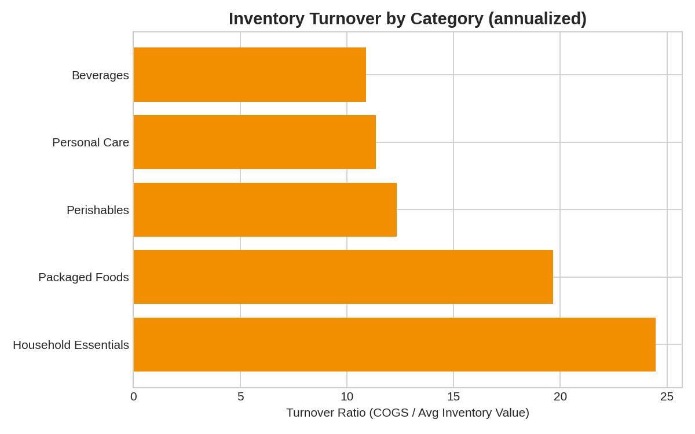
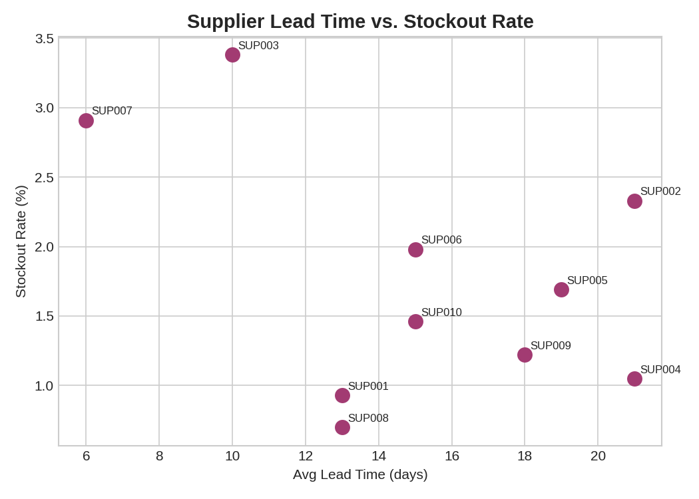
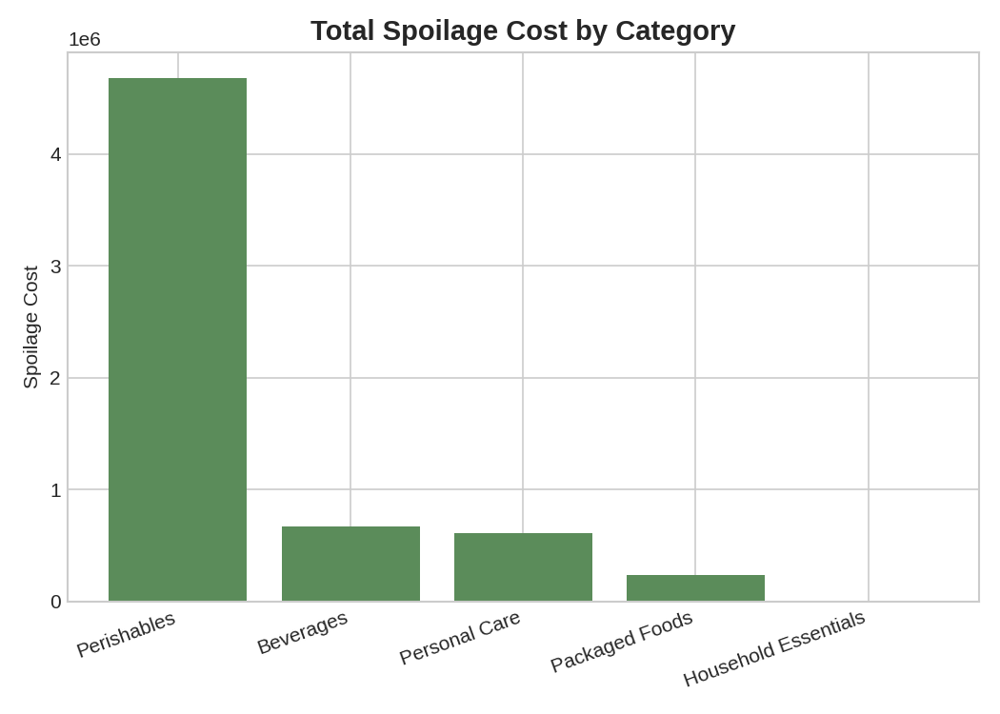
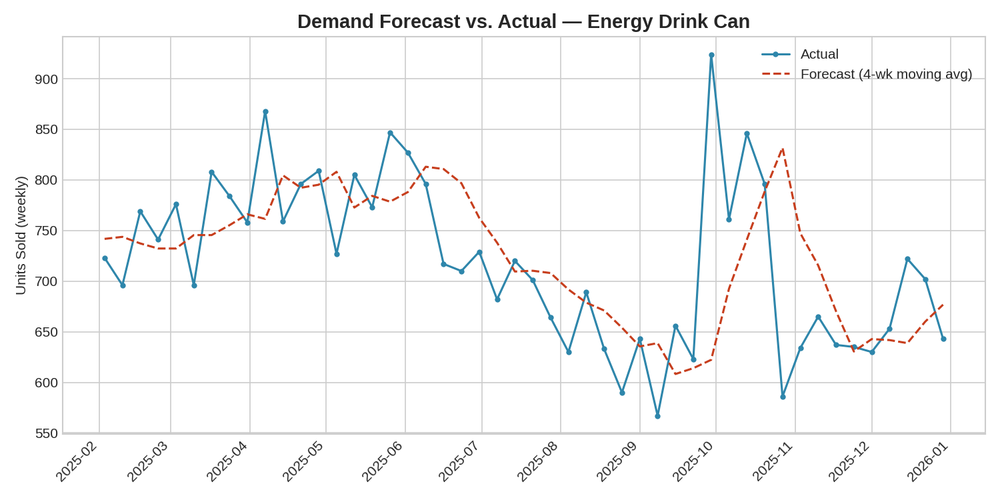

# Retail Inventory & Supply Chain Analytics (SQL + Python + Power BI)

An end-to-end supply chain analytics project for a multi-region retail
chain: why are stores running out of stock, which suppliers are actually
causing it, how much is spoilage costing the business, and can a simple
forecast improve reordering? Built using **SQL**, **Python (pandas)**, and
designed to plug directly into **Power BI** for an interactive dashboard.

## Problem Statement

The chain has stockouts eating into sales and spoilage eating into margin,
but no clear view of *why* — is it demand spikes, slow suppliers, unreliable
suppliers, or badly-set reorder points? This project traces stockouts and
spoilage back to their actual drivers across 16 stores, 30 products, and
10 suppliers over a full year of weekly inventory data.

## Tech Stack

- **Python**: pandas, numpy, matplotlib — cleaning, KPI calculation, root
  cause analysis, and a simple demand forecast
- **SQL**: SQL (queries portable to PostgreSQL/MySQL with minor tweaks)
- **Power BI**: a ready-to-import flat dataset + full DAX measures + a
  page-by-page build guide (`powerbi/POWER_BI_GUIDE.md`) — not a `.pbix`
  file, since that's a binary format unsuited to a Git repo, but everything
  needed to build the dashboard yourself in ~20 minutes
- **Data**: synthetic weekly inventory ledger (52 weeks, 16 stores, 30
  products across 5 categories, 10 suppliers) simulating realistic
  reorder-point behavior, supplier lead times, delivery delays, and
  perishable spoilage — intentionally includes missing values, inconsistent
  text, and duplicates for cleaning practice

## Project Structure

```
retail-supply-chain-analytics/
├── data/
│   ├── inventory_ledger.csv         # raw weekly stock ledger (with data quality issues)
│   ├── inventory_ledger_clean.csv   # cleaned data (output of analysis.py)
│   ├── stores.csv                    # store master data
│   ├── products.csv                  # product catalog
│   ├── suppliers.csv                 # supplier master data
│   ├── powerbi_dataset.csv          # flat, joined table ready for Power BI import
│   └── summary_metrics.csv          # key headline metrics
├── sql/
│   └── schema_and_queries.sql       # table schema + 10 business-question queries
├── images/                          # generated charts
├── powerbi/
│   └── POWER_BI_GUIDE.md            # step-by-step dashboard build guide + DAX measures
├── analysis.py                      # cleaning + KPI + root cause + forecast analysis
├── SUPPLY_CHAIN_RECOMMENDATIONS.md  # actionable supplier/inventory/spoilage strategy
└── README.md
```

## How to Run

```bash
pip install pandas numpy matplotlib
python analysis.py
```

This cleans the data, prints KPI and root-cause analysis to the console,
regenerates all charts in `images/`, and exports the Power BI-ready dataset.

To run the SQL queries, load the cleaned CSVs into SQL:
```bash
SQL3 data/supply_chain.db
.mode csv
.import data/inventory_ledger_clean.csv inventory_ledger
.import data/stores.csv stores
.import data/products.csv products
.import data/suppliers.csv suppliers
.read sql/schema_and_queries.sql
```

To build the dashboard, follow `powerbi/POWER_BI_GUIDE.md`.

## Phase 1 Data Layer

The original `analysis.py` workflow above is preserved. The separate Phase 1
pipeline builds reproducible cleaned data and a SQLite database:

```bash
python -m src.data_cleaning
python -m src.synthetic_sales
python -m src.database
```

Run these commands from the repository root. The first command copies the four
original input CSVs into `data/raw/` once, validates them on later runs, and
writes `data/processed/inventory_clean.csv`. Missing `units_received` remains
NULL with an explicit missing flag. The second command generates
`data/raw/sales.csv` and `data/processed/sales_clean.csv` with random seed 42.
The third rebuilds `data/database/business_analytics.db`, executes all 18
queries in `sql/business_analysis.sql`, checks SQL results against pandas, and
writes `reports/DATA_QUALITY_REPORT.md`.

**Sales orders, transaction prices, and revenue in this new layer are synthetic.**
They are generated from weekly inventory `units_sold` while preserving every
store/product/week quantity. They are not real transactions or recovered orders
from the original project. Each generated order contains one product. The
last inventory week extends to January 4, 2026, so January 2026 sales are a
partial month. Sales begin January 6, 2025, so January 2025 is partial too.
Refer to the data quality report for the unresolved inventory
accounting semantics and stockout flag discrepancies.

## Phase 2: KPI and Multidimensional Analytics

After building the Phase 1 database, run from the repository root:

```bash
python -m src.kpi_analysis
```

This validates SQLite against pandas and writes `data/processed/overall_kpi.csv`,
`monthly_kpi.csv`, `product_kpi.csv`, `category_kpi.csv`, `region_kpi.csv`,
`store_kpi.csv`, `supplier_kpi.csv`, and `latest_inventory_snapshot.csv`.
It also writes seven charts under `images/phase2/`, plus
`reports/KPI_DICTIONARY.md` and `reports/BUSINESS_INSIGHTS.md`.
The SQLite file is rebuildable and is required by this command.

Cumulative KPIs use all observed sales. Only February–December 2025 are
complete calendar months; partial January 2025 and January 2026 are marked in
the monthly CSV and excluded from formal MoM. CSV rates and growth are
proportions, while money uses two decimal places. Revenue and transaction
prices are synthetic; each order is one product row, so AOV is a synthetic
single-item proxy. Stockout and fill-rate figures are based on weekly
inventory records. Supplier reliability is a static synthetic attribute, and
inventory turnover is an approximate analytical ratio.

## Phase 3: Weekly Demand Forecasting

From the repository root, after the Phase 1 processed sales and inventory files
exist, install the forecasting and test dependencies and run:

```bash
pip install pandas numpy scikit-learn pytest
python -m src.forecasting
python -m pytest tests/test_forecasting.py -q
python -m pytest -q
```

The forecasting command validates that synthetic order quantities reconcile to
the weekly inventory ledger, including weeks with zero sales. It creates a
reproducible weekly store/product panel in memory, uses the preceding 30 weeks
for lag and rolling features, and compares a previous-week naive forecast with
Linear Regression and Random Forest on a chronological one-week-ahead test.
It writes `data/processed/forecast_results.csv` and
`reports/MODEL_EVALUATION.md`. The CSV contains historical held-out weeks with
known actuals; it is not a future forecast for current inventory. Order dates
and demand patterns are synthetic, so reported errors validate the workflow
rather than real-world forecasting performance.

## Data Cleaning Steps

- Removed exact duplicate rows
- Standardized inconsistent category naming (`packaged foods` / ` Packaged Foods ` → `Packaged Foods`)
- The original `analysis.py` fills missing `units_received` with 0; the
  Phase 1 pipeline preserves these as NULL with a missing flag

## Key Findings

- **Weekly record-based fill-rate proxy: 98.2%** (1.8% stockout rate). It is
  not an order fulfillment rate.
- **Supplier master attributes and stockouts are associated in this synthetic
  dataset**: the original script reports correlations of -0.45 for lead time
  and -0.44 for static reliability. These do not establish supplier causation.
- **Packaged Foods has the highest weekly record stockout rate (2.2%)** in
  the original analysis; the data do not establish its cause.
- **Perishables have the largest estimated spoilage cost** in the original
  analysis, based on synthetic unit costs.
- **The original script's moving-average demonstration reports ~7% MAPE**
  for one selected product; this is not a validated operational forecast.

### Stockout Rate by Category


### Stockout Rate by Region


### Inventory Turnover by Category


### Supplier Lead Time vs. Stockout Rate


### Spoilage Cost by Category


## Demand Forecast vs. Actual

A simple 4-week moving-average forecast was tested against actual weekly
demand for the highest-volume product in the catalog:



**Interpretation:** even this simple approach tracks actual demand closely
(~7% MAPE), suggesting a low-maintenance forecasting layer could meaningfully
tighten reorder timing chain-wide, especially ahead of seasonal demand spikes.

## Supply Chain Recommendations

See [`SUPPLY_CHAIN_RECOMMENDATIONS.md`](SUPPLY_CHAIN_RECOMMENDATIONS.md) for
the full set of supplier, category, and regional recommendations — including
an honest note on why the lead-time finding looks backwards at first glance.

## Power BI Dashboard

See [`powerbi/POWER_BI_GUIDE.md`](powerbi/POWER_BI_GUIDE.md) for a full
walkthrough: DAX measures, page layouts (Executive Overview, Supplier
Scorecard, Inventory Health), and an optional proper star-schema model.

## Possible Next Steps

- Make safety stock proportional to supplier reliability instead of a flat
  percentage of demand
- Extend the moving-average forecast to every SKU and feed it into the
  reorder-point formula directly
- Add supplier cost data to weigh "switch suppliers" tradeoffs against
  service-level gains
- Publish the Power BI dashboard to the Power BI Service and link it here

---
*Note: Dataset is synthetically generated for portfolio/demonstration purposes and does not represent a real business.*
